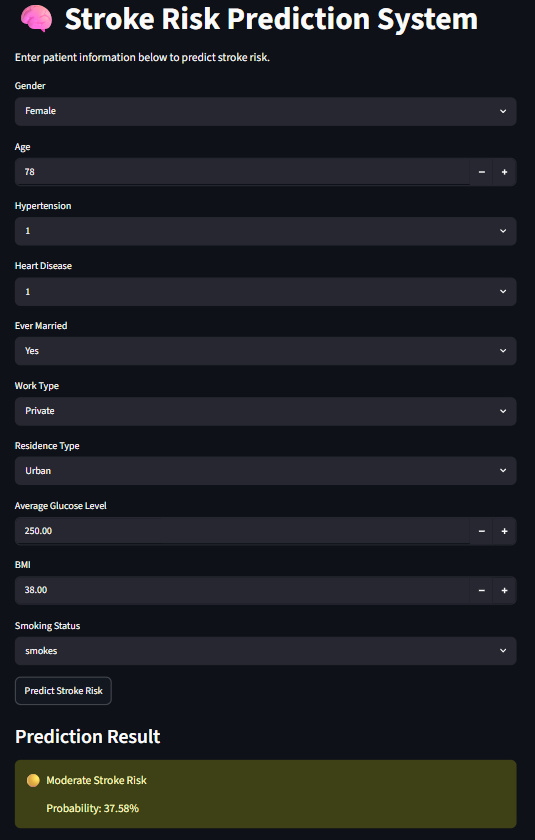
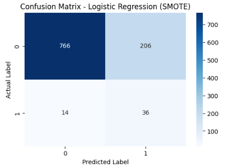
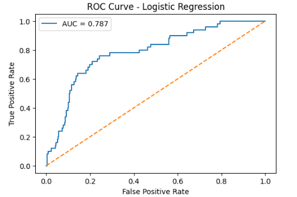
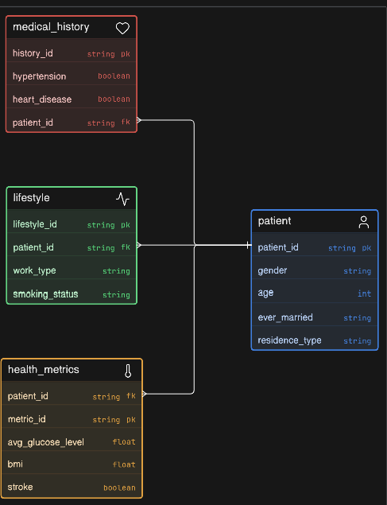

# 🧠 Stroke Risk Prediction System

## 📌 Project Overview

This project predicts the risk of stroke using Machine Learning based on demographic, lifestyle, and medical information. The system processes patient data and classifies individuals into different stroke risk categories through a trained Logistic Regression model.

A Streamlit web application was developed to allow users to enter patient information and instantly receive stroke risk predictions.

---

## 🚀 Features

- Data Cleaning and ETL Pipeline
- Relational Database Design using SQLite
- Exploratory Data Analysis (EDA)
- Hypothesis Testing
- SMOTE for Handling Class Imbalance
- Model Comparison and Evaluation
- Feature Importance Analysis
- SHAP Explainability
- Hyperparameter Tuning
- Interactive Streamlit Web Application

---

## 🛠️ Technologies Used

- Python
- Pandas
- NumPy
- Scikit-Learn
- Streamlit
- SQLite
- Joblib
- Matplotlib
- Seaborn
- SHAP

---

## 📊 Machine Learning Models Evaluated

- Logistic Regression
- Random Forest
- Gradient Boosting

### Final Model Selection

Logistic Regression was selected as the final model because it achieved the highest Recall score after applying SMOTE. In healthcare applications, minimizing missed stroke cases is more important than maximizing overall accuracy.

---

## 📸 Application Screenshot



---

## 📈 Confusion Matrix



---

## 📉 ROC Curve



---

## 🗄️ Database Schema



---

## 📂 Project Structure

```text
Stroke-Risk-Prediction-System/
│
├── app.py
├── requirements.txt
├── stroke_prediction_model.pkl
├── Stroke_prediction.ipynb
├── app_screenshot.png
├── confusion_matrix.png
├── roc_curve.png
├── erd_diagram.png
└── README.md
```

---

## ▶️ Running the Project

### Install Dependencies

```bash
pip install -r requirements.txt
```

### Run the Streamlit Application

```bash
streamlit run app.py
```

---

## 🎯 Future Enhancements

- Deploy the application on Streamlit Cloud
- Add user authentication
- Integrate real-time healthcare datasets
- Improve model performance with advanced ensemble methods
- Create a dashboard for patient analytics

---

## 👩‍💻 Author

Niharika Yarramsetty

B.Tech Computer Science Engineering, VIT-AP University
